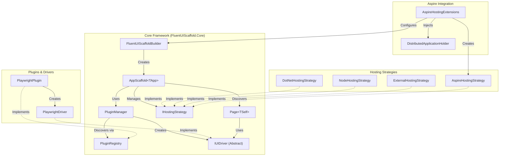
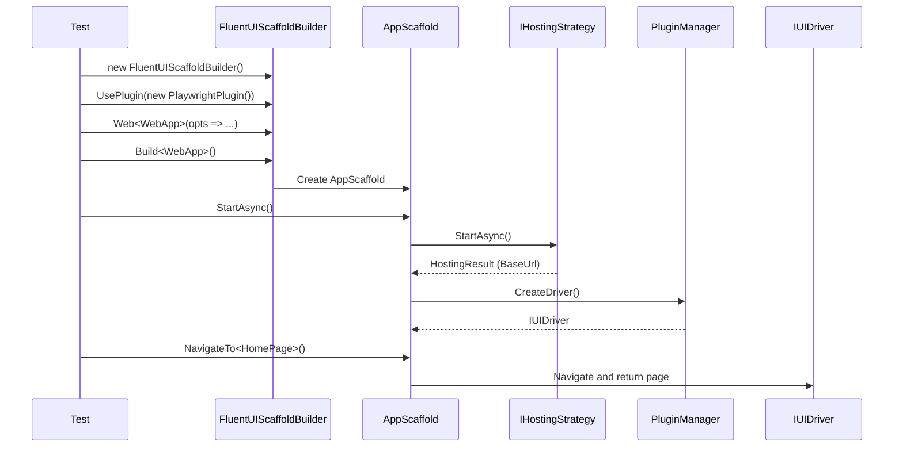

# FluentUIScaffold Architecture Diagram

This diagram illustrates the high-level architecture of the FluentUIScaffold framework, showing the relationships between the core components, plugins, drivers, and hosting strategies.



## Key Components

### 1. AppScaffold<TApp>
The main entry point and async-first orchestrator for the testing framework. It manages the lifecycle of the driver, hosting strategy, and provides methods for navigation and page interaction.

Key Features:
- `StartAsync()` - Starts hosting strategy and initializes framework
- `DisposeAsync()` - Cleans up resources
- `NavigateTo<TPage>()` - Navigates to a page object
- `On<TPage>()` - Attaches to current page without navigation
- `WaitFor<TPage>()` - Waits for a page to be ready

### 2. Plugin Architecture
- **IUITestingFrameworkPlugin**: Interface for adding new UI testing frameworks (e.g., Playwright).
- **PluginManager / PluginRegistry**: Handle the registration and activation of plugins.
- **IUIDriver**: An abstraction layer over specific UI testing tools, allowing the core framework to remain tool-agnostic.

### 3. Hosting Strategies

The `IHostingStrategy` interface provides a unified abstraction for managing application servers:

| Strategy | Description | Use Case |
|----------|-------------|----------|
| `DotNetHostingStrategy` | Manages .NET app via `dotnet run` | Standard .NET apps |
| `NodeHostingStrategy` | Manages Node.js app via `npm run` | Node.js/SPA apps |
| `ExternalHostingStrategy` | Health check only, no process management | CI/staging environments |
| `AspireHostingStrategy` | Wraps Aspire testing builder | Aspire distributed apps |

### 4. Page Object Model

The `Page<TSelf>` base class implements the Page Object Pattern with a self-referencing generic for fluent API support:

```csharp
public class HomePage : Page<HomePage>
{
    public IElement Button { get; private set; } = null!;

    public HomePage(IServiceProvider sp, Uri url) : base(sp, url) { }

    protected override void ConfigureElements()
    {
        Button = Element("#button")
            .WithWaitStrategy(WaitStrategy.Clickable)
            .Build();
    }

    public HomePage ClickButton()
    {
        return Click(p => p.Button);
    }
}
```

Key Features:
- **Auto-Discovery**: The framework can automatically discover and register page components via `WithAutoPageDiscovery()`.
- **Fluent Interactions**: `Click()`, `Type()`, `Select()`, `WaitForVisible()` all return `TSelf` for chaining.
- **Fluent Verification**: `page.Verify.Visible(p => p.Element)` for type-safe assertions.

### 5. Aspire Integration
- **AspireHostingExtensions**: Provides fluent methods to integrate Aspire's distributed application testing with FluentUIScaffold.
- **AspireHostingStrategy**: Wraps `DistributedApplicationTestingBuilder` from Aspire.Hosting.Testing.
- **DistributedApplicationHolder**: Stores the `DistributedApplication` instance in DI for test access.

## Initialization Flow



## Configuration Example

```csharp
var app = new FluentUIScaffoldBuilder()
    .UsePlugin(new PlaywrightPlugin())
    .Web<WebApp>(opts =>
    {
        opts.BaseUrl = new Uri("https://localhost:5001");
        opts.DefaultWaitTimeout = TimeSpan.FromSeconds(30);
        opts.HeadlessMode = true;
    })
    .WithAutoPageDiscovery()
    .Build<WebApp>();

await app.StartAsync();

// Use the app
app.NavigateTo<HomePage>()
    .Click(p => p.LoginButton)
    .NavigateTo<LoginPage>()
    .Type(p => p.Username, "admin")
    .Type(p => p.Password, "password")
    .Click(p => p.SubmitButton)
    .Verify.Visible(p => p.WelcomeMessage);

await app.DisposeAsync();
```
