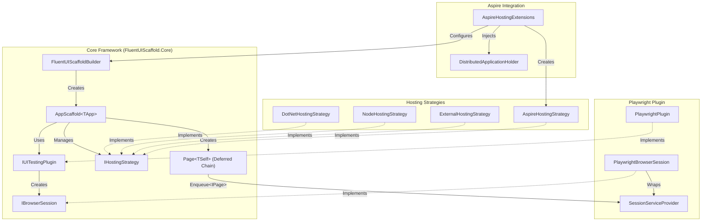
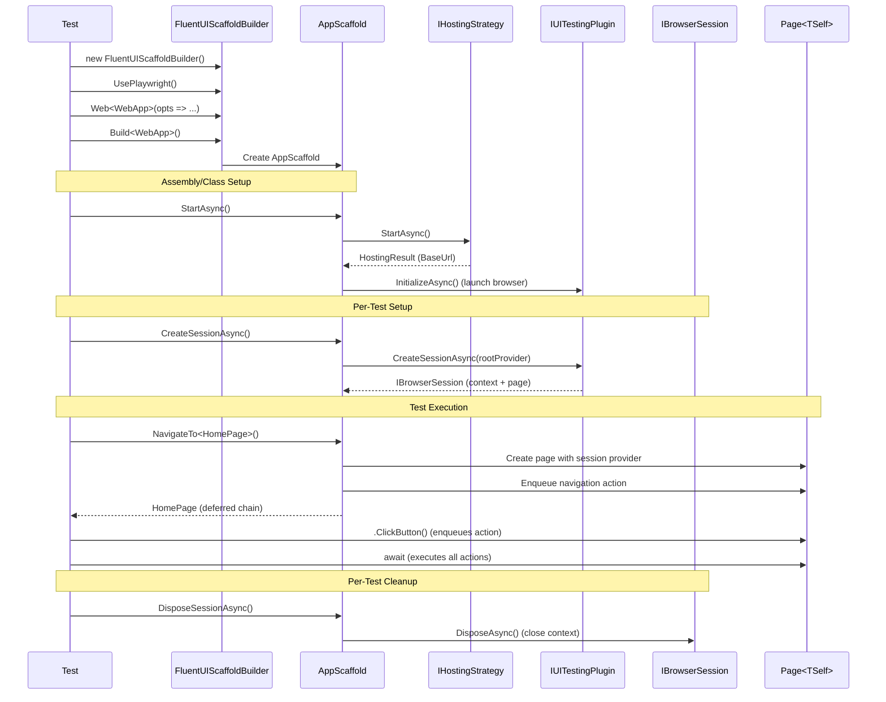

# FluentUIScaffold Architecture Diagram

This diagram illustrates the high-level architecture of the FluentUIScaffold framework, showing the relationships between the core components, plugins, sessions, and hosting strategies.


```mermaid
graph TD
    subgraph "Core Framework (FluentUIScaffold.Core)"
        App["AppScaffold&lt;TApp&gt;"]
        Builder["FluentUIScaffoldBuilder"]
        Plugin["IUITestingPlugin"]
        Session["IBrowserSession"]
        HS["IHostingStrategy"]
        Page["Page&lt;TSelf&gt; (Deferred Chain)"]
    end

    subgraph "Playwright Plugin"
        PP["PlaywrightPlugin"]
        PBS["PlaywrightBrowserSession"]
        SSP["SessionServiceProvider"]
    end

    subgraph "Hosting Strategies"
        DHS["DotNetHostingStrategy"]
        NHS["NodeHostingStrategy"]
        EHS["ExternalHostingStrategy"]
        AHS["AspireHostingStrategy"]
    end

    subgraph "Aspire Integration"
        AH["AspireHostingExtensions"]
        DASH["DistributedApplicationHolder"]
    end

    %% Relationships
    Builder -->|Creates| App
    App -->|Uses| Plugin
    Plugin -->|Creates| Session
    App -->|Manages| HS
    App -->|Creates| Page

    PP -.->|Implements| Plugin
    PBS -.->|Implements| Session
    PBS -->|Wraps| SSP

    DHS -.->|Implements| HS
    NHS -.->|Implements| HS
    EHS -.->|Implements| HS
    AHS -.->|Implements| HS

    AH -->|Injects| DASH
    AH -->|Configures| Builder
    AH -->|Creates| AHS

    Page -->|Enqueue&lt;IPage&gt;| SSP
```

## Key Components

### 1. AppScaffold\<TApp>
The central hub for test infrastructure. Manages hosting, plugin lifecycle, and per-test browser session creation.

Key Features:
- `StartAsync()` - Starts hosting strategy and initializes plugin (launches browser)
- `CreateSessionAsync()` / `DisposeSessionAsync()` - Per-test session lifecycle
- `NavigateTo<TPage>()` - Creates page objects with navigation enqueued
- `On<TPage>()` - Creates page objects without navigation
- `DisposeAsync()` - Cleans up everything

### 2. Plugin Architecture
- **IUITestingPlugin**: Plugin contract that owns the browser singleton and creates per-test sessions. Methods: `ConfigureServices()`, `InitializeAsync()`, `CreateSessionAsync()`.
- **PlaywrightPlugin**: Concrete implementation that manages the Playwright browser and creates `PlaywrightBrowserSession` instances.

### 3. Browser Sessions
- **IBrowserSession**: Per-test isolated session with its own browser context and page. Provides a `ServiceProvider` for resolving session-scoped services.
- **PlaywrightBrowserSession**: Owns an `IBrowserContext` and `IPage`. Disposed after each test.
- **SessionServiceProvider**: Lightweight wrapper that resolves session services (`IPage`, `IBrowserContext`, `IBrowser`) first, then falls back to the root provider.

### 4. Hosting Strategies

The `IHostingStrategy` interface provides a unified abstraction for managing application servers:

| Strategy | Description | Use Case |
|----------|-------------|----------|
| `DotNetHostingStrategy` | Manages .NET app via `dotnet run` | Standard .NET apps |
| `NodeHostingStrategy` | Manages Node.js app via `npm run` | Node.js/SPA apps |
| `ExternalHostingStrategy` | Health check only, no process management | CI/staging environments |
| `AspireHostingStrategy` | Wraps Aspire testing builder | Aspire distributed apps |

### 5. Page Object Model (Deferred Execution Chain)

The `Page<TSelf>` base class implements a deferred execution chain pattern:

```csharp
[Route("/")]
public class HomePage : Page<HomePage>
{
    public HomePage(IServiceProvider serviceProvider) : base(serviceProvider) { }

    public HomePage ClickButton() => Enqueue<IPage>(async page =>
    {
        await page.ClickAsync("#button");
    });

    public LoginPage GoToLogin() => NavigateTo<LoginPage>();
}
```

Key Features:
- **Deferred Execution**: Actions are queued, not executed immediately. The chain executes when awaited via `GetAwaiter()`.
- **DI-Injected Lambdas**: `Enqueue<T>` resolves services from the session provider at execution time.
- **Cross-Page Chaining**: `NavigateTo<TTarget>()` freezes the source page and shares the action list with the target page.
- **Direct Playwright Access**: `Enqueue<IPage>` gives full access to Playwright's `IPage` API.

### 6. Aspire Integration
- **AspireHostingExtensions**: Provides fluent methods to integrate Aspire's distributed application testing with FluentUIScaffold.
- **AspireHostingStrategy**: Wraps `DistributedApplicationTestingBuilder` from Aspire.Hosting.Testing.
- **DistributedApplicationHolder**: Stores the `DistributedApplication` instance in DI for test access.

## Initialization Flow


```mermaid
sequenceDiagram
    participant Test
    participant Builder as FluentUIScaffoldBuilder
    participant App as AppScaffold
    participant HS as IHostingStrategy
    participant Plugin as IUITestingPlugin
    participant Session as IBrowserSession
    participant Page as Page<TSelf>

    Test->>Builder: new FluentUIScaffoldBuilder()
    Test->>Builder: UsePlaywright()
    Test->>Builder: Web<WebApp>(opts => ...)
    Test->>Builder: Build<WebApp>()
    Builder->>App: Create AppScaffold

    Note over Test,App: Assembly/Class Setup
    Test->>App: StartAsync()
    App->>HS: StartAsync()
    HS-->>App: HostingResult (BaseUrl)
    App->>Plugin: InitializeAsync() (launch browser)

    Note over Test,Session: Per-Test Setup
    Test->>App: CreateSessionAsync()
    App->>Plugin: CreateSessionAsync(rootProvider)
    Plugin-->>App: IBrowserSession (context + page)

    Note over Test,Page: Test Execution
    Test->>App: NavigateTo<HomePage>()
    App->>Page: Create page with session provider
    App->>Page: Enqueue navigation action
    App-->>Test: HomePage (deferred chain)
    Test->>Page: .ClickButton() (enqueues action)
    Test->>Page: await (executes all actions)

    Note over Test,Session: Per-Test Cleanup
    Test->>App: DisposeSessionAsync()
    App->>Session: DisposeAsync() (close context)
```

## Configuration Example

```csharp
var app = new FluentUIScaffoldBuilder()
    .UsePlaywright()
    .Web<WebApp>(opts =>
    {
        opts.BaseUrl = new Uri("https://localhost:5001");
        opts.HeadlessMode = true;
    })
    .Build<WebApp>();

await app.StartAsync();

// Per-test lifecycle
await app.CreateSessionAsync();

await app.NavigateTo<HomePage>()
    .ClickLogin()
    .NavigateTo<LoginPage>()
    .EnterUsername("admin")
    .EnterPassword("password")
    .SubmitForm();

await app.DisposeSessionAsync();
await app.DisposeAsync();
```
