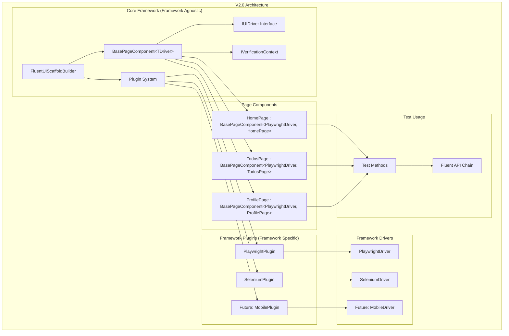
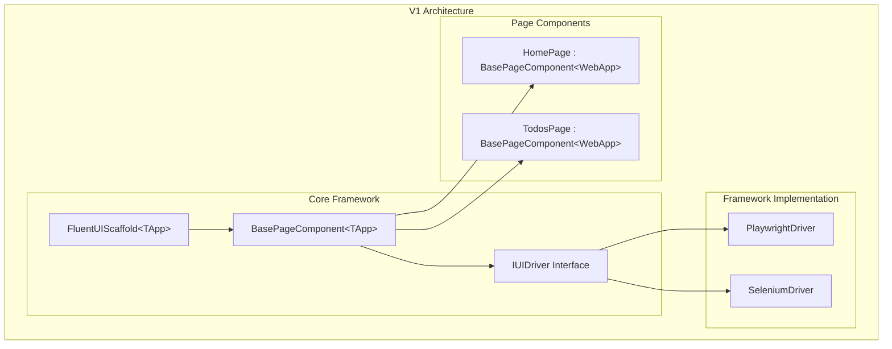
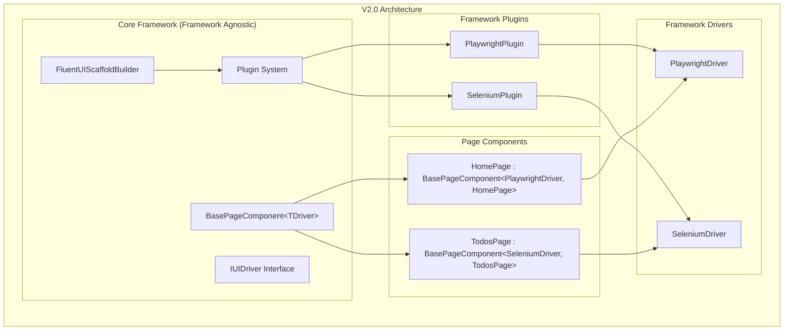
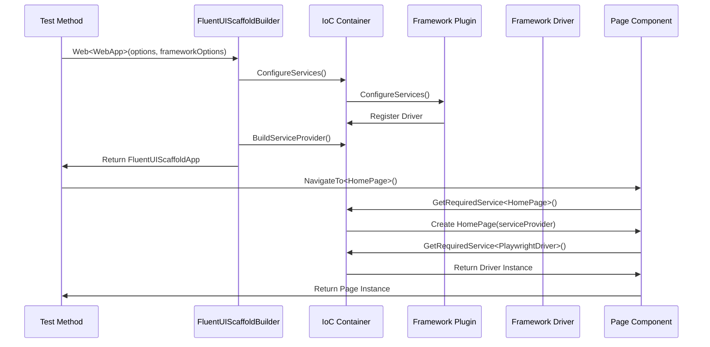
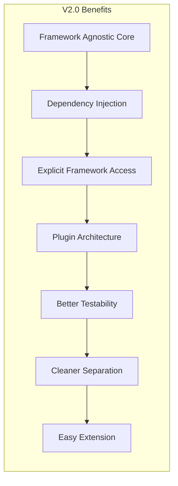
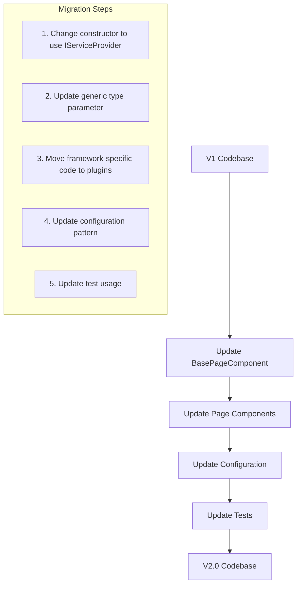

# Fluent UI Scaffold V2.0 Architecture Diagram

## Architecture Overview



## V1 vs V2.0 Comparison

### V1 Architecture (Tightly Coupled)



### V2.0 Architecture (Framework Agnostic)



## Dependency Injection Flow



## Key Differences

### 1. Constructor Pattern

**V1:**
```csharp
public HomePage(IUIDriver driver, FluentUIScaffoldOptions options, ILogger logger)
    : base(driver, options, logger)
{
    ConfigureElements();
}
```

**V2.0:**
```csharp
public HomePage(IServiceProvider serviceProvider) 
    : base(serviceProvider, new Uri("/"))
{
    // Dependencies resolved from IoC container
}
```

### 2. Framework Access

**V1:**
```csharp
// No direct framework access
public class HomePage : BasePageComponent<WebApp>
{
    // Framework-specific code mixed with page logic
}
```

**V2.0:**
```csharp
// Direct framework access through Driver property with fluent API context
public class HomePage : BasePageComponent<PlaywrightDriver, HomePage>
{
    public HomePage UsePlaywrightSpecificFeature()
    {
        Driver.InterceptNetworkRequests("/api/auth", response => {
            // Playwright-specific code
        });
        return this; // Returns HomePage for fluent API
    }
}
```

### 3. Plugin Registration

**V1:**
```csharp
// Hard-coded framework detection
private static void ConfigureServices(IServiceCollection services, FluentUIScaffoldOptions options)
{
    // Try to find Playwright plugin via reflection
    var playwrightPluginType = Type.GetType("FluentUIScaffold.Playwright.PlaywrightPlugin, FluentUIScaffold.Playwright");
    if (playwrightPluginType != null)
    {
        // Register Playwright
    }
    else
    {
        // Fallback to default driver
    }
}
```

**V2.0:**
```csharp
// Explicit plugin configuration
var fluentUI = FluentUIScaffoldBuilder.Web<WebApp>(options =>
{
    options.BaseUrl = new Uri("https://localhost:5001");
}, frameworkOptions =>
{
    frameworkOptions.UsePlaywright(new PlaywrightOptions
    {
        Headless = false,
        SlowMo = 1000
    });
});
```

## Benefits Visualization



## Migration Path



This architecture diagram shows how V2.0 achieves true framework agnosticism while maintaining the ability to access framework-specific features when needed. The core framework is completely independent, and framework implementations are pluggable extensions. 